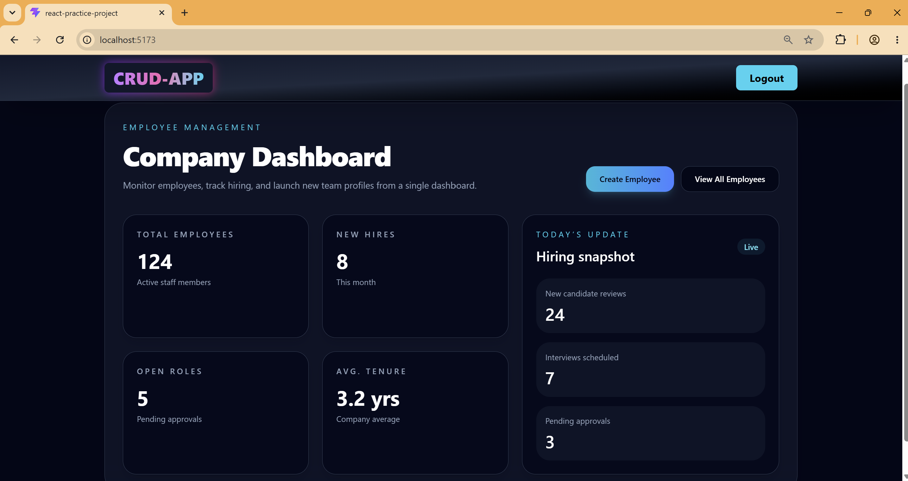
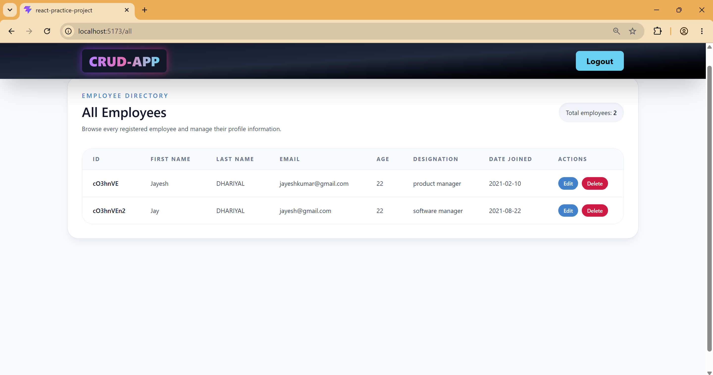
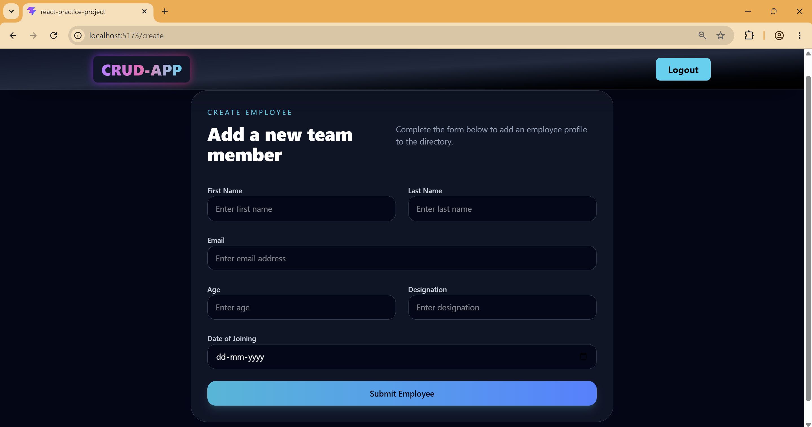
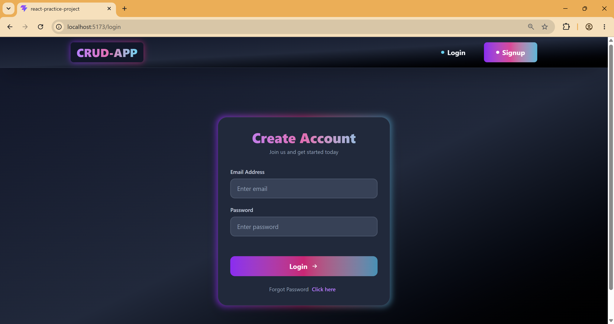

# React Employee Management Dashboard

A modern React + Vite employee CRUD dashboard with Tailwind UI styling, signup/login workflow, and a local JSON Server backend.

## 🚀 Project Overview

This project is a responsive employee dashboard built with:
- React 19 + Vite
- Tailwind CSS for styling
- React Router DOM for page navigation
- Axios for HTTP requests
- JSON Server as a local mock backend

The app includes:
- Protected homepage access after login
- Signup and login flows
- Create employee profiles
- View employees in a responsive table
- Edit employee records
- Delete employee entries

## 🧭 Application Pages

| Page | Route | Description |
| --- | --- | --- |
| Home Dashboard | `/` | Overview cards and quick navigation |
| Signup | `/signup` | New user registration |
| Login | `/login` | User authentication |
| Create Employee | `/create` | Add a new employee profile |
| All Employees | `/all` | List, edit, and delete employees |
| Edit Employee | `/edit/:id` | Update employee details |

## 📁 Important Files

- `src/pages/HomePage.jsx` — dashboard overview
- `src/pages/SignupPage.jsx` — signup form
- `src/pages/LoginPage.jsx` — login form and auth logic
- `src/pages/CreateEmployee.jsx` — employee creation form
- `src/pages/AllEmployees.jsx` — employee table with actions
- `src/pages/EditEmployees.jsx` — employee edit form
- `src/router/Router.jsx` — app routing
- `src/components/Navbar.jsx` — top navigation bar
- `backend/db.json` — JSON Server seed data

## 🔧 Setup Instructions

1. Install dependencies:
```bash
npm install
```
2. Start JSON Server backend:
```bash
npm run start
```
3. Start the Vite dev server:
```bash
npm run dev
```

Open the app at `http://localhost:5173` and make sure JSON Server is running on `http://localhost:5000`.

## ✅ Features

### Authentication
- Signup persists users in `backend/db.json`
- Login checks stored user credentials
- Authentication token stored in `localStorage`
- Protected home route for authenticated users only

### Employee Management
- `GET /employee` to fetch employee list
- `POST /employee` to create new employee
- `PUT /employee/:id` to update employee details
- `DELETE /employee/:id` to remove employee records

### User Interface
- Tailwind CSS responsive design
- Clean dashboard cards and forms
- Styled employee table with hover effects
- Gradient buttons and rounded containers

## 🖼️ Screenshots







## 📌 Backend Seed Data

The app uses `backend/db.json` with sample accounts and employees:

```json
{
  "users": [
    {
      "username": "Jayesh Dhariyal",
      "email": "jayeshkumardhariyal@gmail.com",
      "password": "12345",
      "id": "eokr7JA3m7Q"
    },
    {
      "username": "Aayush sharma",
      "email": "aayushsharma@gmail.com",
      "password": "Aayush@112",
      "id": "YO14vozX90s"
    }
  ],
  "employee": [
    {
      "firstName": "Jayesh",
      "lastName": "DHARIYAL",
      "email": "jayeshkumar@gmail.com",
      "age": "22",
      "designation": "product manager",
      "doj": "2021-02-10",
      "id": "cO3hnVE"
    },
    {
      "firstName": "Jay",
      "lastName": "DHARIYAL",
      "email": "jayesh@gmail.com",
      "age": "22",
      "designation": "software manager",
      "doj": "2021-08-22",
      "id": "cO3hnVEn2"
    }
  ]
}
```

